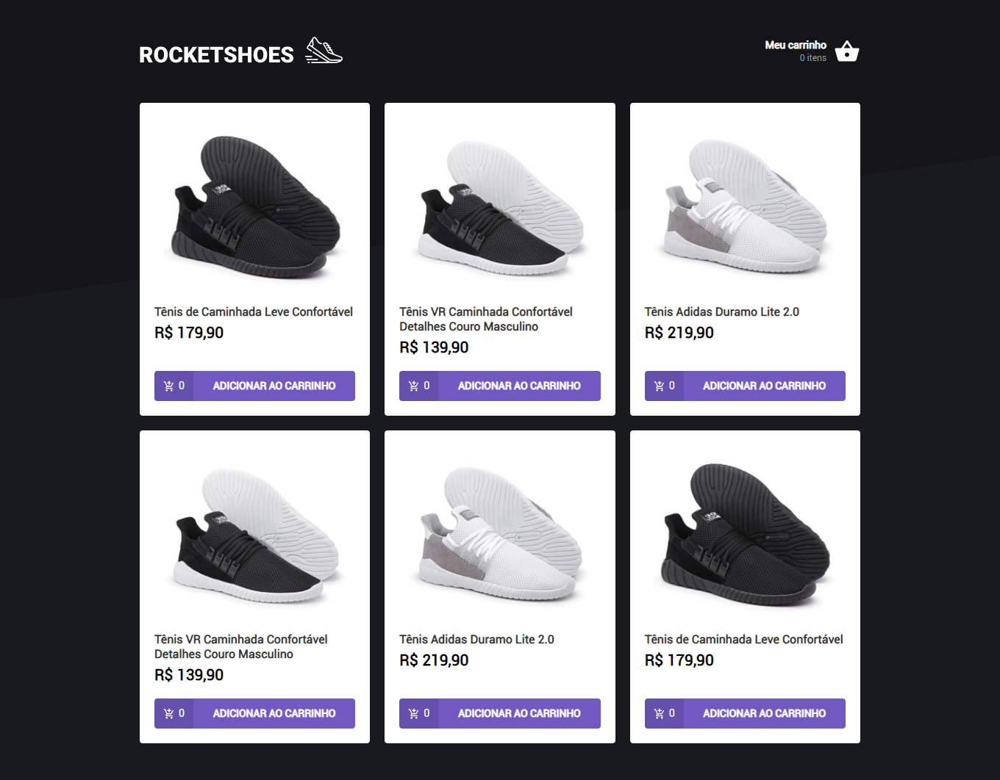

<h1 align="center" >  
  
</h1>

<h2>:rocket: Tecnologias utilizadas</h2>

-  [React](https://reactjs.org/)
-  [Redux](https://redux.js.org/)
-  [Redux-Saga](https://redux-saga.js.org/)
-  [Axios](https://github.com/axios/axios)
-  [styled-components](https://www.styled-components.com/)

<h2>💻 Projeto</h2>

RocketShoes é uma aplicação de compras online. A aplicação Web e a aplicação mobile podem ser usadas pelos usuários que querem efetuarem compras de maneira simples e fácil.

<h2>:question: Instruções para testar o projeto</h2>

Execute no terminal:

**1. Baixe as dependências do projeto.** 
`yarn` 

**2. Execute o projeto.** 
`yarn start`

O projeto irá executar em: [http://localhost:3000](http://localhost:3000)

## :memo: Licença

Esse projeto está sob a licença MIT. Veja o arquivo [LICENSE](LICENSE.md) para mais detalhes.
